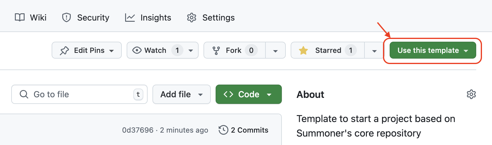

# Starter Template

This repository is a **starter template** for building Python and Rust projects that integrate with [Summoner's core codebase](https://github.com/Summoner-Network/summoner-core) for client/server communication.

It bootstraps a virtual environment, installs all dependencies, and provides tooling to validate the setup and run a test server.

## Getting Started

To create your own project using this starter:

<p align="center">
  
</p>

1. Click the **"Use this template"** button at the top of the [GitHub repository page](https://github.com/Summoner-Network/starter-template).
2. Select **"Create a new repository"**.
3. Name your project and click **"Create repository from template"**.

This will create your own copy of the repo that you can clone and start working from.

## Installation

First, clone the template repository and navigate into it:

```bash
git clone https://github.com/Summoner-Network/your_repo_name.git
cd your_repo_name
```

Then, to install Summoner's core codebase and its Python and Rust dependencies:

```bash
source install.sh setup
```

This will:

* Clone Summoner's core codebase into `core/`
* Create a virtual environment in `venv/`
* Install all required Python and Rust packages
* Install the core package into the environment

### Optional: Using `bash` Instead of `source`

You may also run:

```bash
bash install.sh setup
```

However, if you do, you will need to **activate the virtual environment manually**:

```bash
source venv/bin/activate
```

## Verifying the Installation

To launch a test server:

```bash
bash install.sh test_server
```

This will:

* Create `test_server.py`
* Create `test_server_config.json`
* Launch the server using the installed Summoner core package
* Generate `test_Server.log`

You should see no import errors in `test_server.py` (if not, see [VSCode Integration](#vscode-integration)). In particular, this line should be recognized:

```python
from summoner.server import SummonerServer
```

### VSCode Integration

To ensure VSCode recognizes the Summoner core dependency and your virtual environment:

1. Open the Command Palette: `Ctrl+Shift+P` (or `Cmd+Shift+P` on macOS)
2. Run: `Python: Select Interpreter`
3. Select the one labeled `'venv':venv`
4. Close and reopen the file `test_server.py`

Once selected, VSCode will resolve `summoner` correctly as a dependency installed in `venv/lib`.

## Cleaning and Resetting

To clean generated test files:

```bash
bash install.sh clean
```

This removes:

* Any `test_*.py` files
* Any `test_*.json` files
* Any `test_*.log` files

To fully reset the setup (delete `venv/` and `core/` and reinstall everything):

```bash
bash install.sh reset
```

To delete all environment and Summoner core files:

```bash
bash install.sh delete
```

## Using the Summoner Core in Your Project

While the virtual environment is active:

```bash
source venv/bin/activate
```

You can import and use `summoner` like any other Python package:

```python
from summoner.server import SummonerServer
```

It is installed inside `venv/lib` along with all other dependencies.

## Repo Structure (Initial)

```
├── img/                     # Images used in the README
├── install.sh               # Bootstrap script for setup and testing
├── README.md
└── tooling/                 # Your native package goes here
```

After running `install.sh setup` and `install.sh test_server`, the structure will look like:

```
├── core/                    # Temporary clone of the Summoner core
├── tooling/                 # Your in-development native module(s)
├── venv/                    # Python virtual environment
├── test_server.py           # Autogenerated test file
├── test_server_config.json
├── logs/
│   └── test_Server.log
└── ...
```

> Note: Your module is merged into an SDK during **SDK composition** (in an SDK project), not during this template's install.

## Developing a Native Module (`tooling/`)

Write your package inside the `tooling/` directory. For example:

```
tooling/your_package/
├── __init__.py         # e.g., contains: from .agent import Agent
├── agent.py
└── ...
```

If you use subpackages, each subfolder you want installed must also include an `__init__.py`:

```
tooling/your_package/
├── __init__.py
└── subpkg/
   ├── __init__.py      # required so pip installs the subpackage
   └── feature.py
```

Re-export what you want to expose in `__init__.py`. During development, import your code with the `tooling.*` namespace:

```python
from tooling.your_package import Agent
```

Keep a single `requirements.txt` at the **repo root**. The SDK builder installs from this file during composition.

## SDK Construction

When composing an SDK (in an SDK project), the builder will:

* Clone the `summoner-core` repository
* Copy your `tooling/<pkg>/` folder(s) into the SDK under `summoner/<pkg>/`
* **Rewrite only** imports of the form:

  ```python
  from tooling.your_package import Agent
  ```

  to the public namespace:

  ```python
  from summoner.your_package import Agent
  ```
* Leave any existing `summoner.*` imports **unchanged**

As a result, your development imports remain simple while authoring (`from tooling...`), and users of the composed SDK import everything under the public namespace (`from summoner...`).

## Resources

* [Summoner Core GitHub Repository](https://github.com/Summoner-Network/summoner-core)
